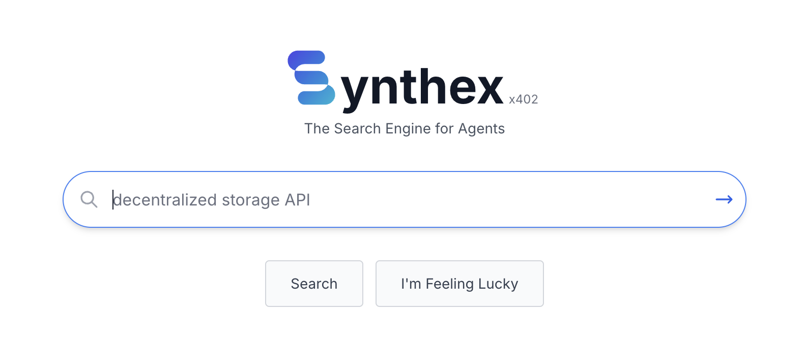
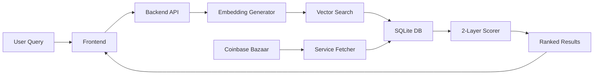

<div align="center">



# Synthex

**The Search Engine for AI Agents**

[](LICENSE)
[](https://nodejs.org/)
[](https://www.typescriptlang.org/)
[](https://github.com/QuantumAgentic/Synthex)
[](https://github.com/QuantumAgentic/Synthex)

[Live Demo](https://x402synthex.xyz) • [Twitter](https://x.com/synthex_x402) • [Report Bug](https://github.com/QuantumAgentic/Synthex/issues) • [Request Feature](https://github.com/QuantumAgentic/Synthex/issues)

</div>

---

## 🌟 Overview

**Synthex** is a **local-first, open-source search engine for agents** - discovering x402 protocol AI services. It combines the power of local AI embeddings with intelligent multi-layer scoring to help you find the perfect AI service for your needs - all running entirely on your machine, no cloud dependencies required.

### Why Synthex?

- **Privacy-First**: All data stays on your machine
- **No API Keys**: Uses local AI models via Transformers.js
- **100% Free**: No payment required, no usage limits
- **Lightning Fast**: In-memory vector search with SQLite
- **Web3 Ready**: Connect Base (Coinbase Wallet, MetaMask) or Solana (Phantom, Solflare) wallets
- **Modern UI**: Beautiful Next.js interface with Tailwind CSS

---

## ✨ Features

### Core Capabilities

- **Semantic Search**: Natural language queries powered by local AI embeddings (384-dimensional vectors)
- **SQLite Storage**: Lightweight, fast, and reliable local database
- **Local AI**: Runs embeddings locally using Transformers.js (all-MiniLM-L6-v2 model)
- **Smart Caching**: In-memory cache with TTL for instant repeat queries
- **2-Layer Scoring**: Bazaar Quality (50%) + AI Similarity (50%)
- **Real-Time Data**: Fetches latest services from Coinbase Bazaar
- **Service Testing**: Built-in endpoint tester with multi-format response viewers (JSON, images, PDFs, etc.)

### Web3 Integration

- **Base Network**: Coinbase Wallet, MetaMask support
- **Solana Network**: Phantom, Solflare wallet support
- **Test External Services**: Connect wallets to test services that require payment or authentication

---

## 🚀 Quick Start

### One-Command Setup

```bash
# Clone the repository
git clone https://github.com/QuantumAgentic/Synthex.git
cd Synthex

# Run setup script (installs deps, downloads models, initializes DB)
npm run setup

# Start the application (auto-builds and starts production server)
npm run start
```

**That's it!** The `npm run start` command will automatically build the application for production and start both the frontend and backend servers.

Access Synthex at:
- Frontend: http://localhost:3000
- Backend API: http://localhost:3001

### Prerequisites

- Node.js 20+ ([Download](https://nodejs.org/))
- npm or yarn
- ~500MB disk space (for database and AI models)

### Manual Installation

If the setup script fails, you can install manually:

```bash
# Install backend dependencies
cd backend && npm install && cd ..

# Install frontend dependencies
cd frontend && npm install && cd ..

# Configure frontend environment
cp frontend/.env.example frontend/.env.local
# Edit frontend/.env.local if needed (default: http://localhost:3001/search)

# Initialize database and download AI models
node scripts/init-database.js

# Build and start both servers (recommended)
npm run start

# OR manually start in separate terminals:
# Terminal 1: Build and start backend
cd backend && npm run build && npm start

# Terminal 2: Build and start frontend
cd frontend && npm run build && npm start
```

---

## 📖 Usage

### Semantic Search

Open http://localhost:3000 and search using natural language:

```
"weather api for ethereum"
"nft minting service on solana"
"price oracle for base network"
"token swap with low fees"
```

### REST API

```bash
# Search services
curl "http://localhost:3001/search?q=weather"

# Get all services
curl "http://localhost:3001/services"

# Get service by ID
curl "http://localhost:3001/services/1"

# Health check
curl "http://localhost:3001/health"

# Database statistics
curl "http://localhost:3001/stats"
```

### Service Testing

1. Click on any service result
2. Connect your wallet (if service requires payment)
3. Test endpoints with the built-in tester
4. View responses in JSON, Image, PDF, or other formats

---

## 🏗️ Architecture

### Technology Stack

#### Frontend
- **Next.js 14** (App Router)
- **React 18** with TypeScript
- **Tailwind CSS** for styling
- **RainbowKit + Wagmi** (Base: Coinbase Wallet, MetaMask)
- **Solana Wallet Adapter** (Phantom, Solflare)
- **Playwright E2E** testing (100% pass rate)

#### Backend
- **Express.js** server
- **TypeScript** for type safety
- **SQLite** + better-sqlite3
- **Transformers.js** for local AI embeddings
- **Coinbase Bazaar API** integration

### How It Works



1. **Data Collection**: Fetches x402 services from Coinbase Bazaar API
2. **Normalization**: Extracts structured metadata (name, description, chains, assets)
3. **Embedding Generation**: Creates 384-dimensional vectors using all-MiniLM-L6-v2
4. **Vector Storage**: Stores embeddings in SQLite for fast cosine similarity search
5. **Search**: User query → embedding → vector similarity + quality scoring
6. **Ranking**: Returns top results sorted by combined score

### Scoring Algorithm

Since we only have Bazaar data (no x402scan trust or xgate performance metrics), we use a simplified **2-layer scoring system**:

```
Final Score = (Bazaar Quality × 0.5) + (AI Similarity × 0.5)

Layer 1 - Bazaar Quality (50%):
  - Data completeness (name, description, etc.)
  - Metadata richness (chains, assets, tags)
  - Schema validation

Layer 2 - AI Similarity (50%):
  - Semantic similarity to user query
  - Cosine distance in 384-D vector space
```

---

## 📂 Project Structure

```
Synthex/
├── frontend/                 # Next.js frontend application
│   ├── app/                  # App router pages
│   │   ├── page.tsx          # Homepage (search)
│   │   ├── about/            # About page
│   │   ├── docs/             # API documentation
│   │   └── service/[id]/     # Service detail page
│   ├── components/           # React components
│   │   ├── Logo.tsx
│   │   ├── Header.tsx
│   │   ├── Footer.tsx
│   │   ├── SearchBar.tsx
│   │   ├── ResultCard.tsx
│   │   ├── wallet/           # Web3 wallet components
│   │   └── service/          # Service testing components
│   ├── lib/                  # Utilities
│   └── public/               # Static assets (logo, etc.)
├── backend/                  # Express.js backend
│   ├── src/
│   │   ├── routes/           # API routes
│   │   │   └── index.ts      # /search, /services, /health, /stats
│   │   ├── services/         # Business logic
│   │   │   ├── aggregators/  # Data fetching
│   │   │   │   ├── bazaar.ts       # Coinbase Bazaar client
│   │   │   │   └── normalizer.ts   # Service normalizer
│   │   │   ├── ai/           # AI & embeddings
│   │   │   │   ├── embeddings.ts   # Local embedding generator
│   │   │   │   └── search.ts       # Vector similarity search
│   │   │   └── db/           # Database layer
│   │   │       └── sqlite.ts       # SQLite operations + cache
│   │   ├── config/           # Environment configuration
│   │   └── types/            # TypeScript type definitions
│   └── data/                 # SQLite database file
├── scripts/                  # Automation scripts
│   ├── init-database.js      # Database initialization
│   └── setup.sh              # One-command setup
├── e2e/                      # End-to-end tests (Playwright)
├── .gitignore
├── package.json              # Monorepo root
├── LICENSE                   # BSD 3-Clause License
└── README.md                 # This file
```

---

## ⚙️ Configuration

### Backend Environment Variables

Create `backend/.env`:

```bash
# Server
PORT=3001
NODE_ENV=development

# Database
DATABASE_PATH=./data/synthex.db

# CORS
ALLOWED_ORIGINS=http://localhost:3000,http://localhost:3001

# AI Embedding Model
EMBEDDING_MODEL=Xenova/all-MiniLM-L6-v2
EMBEDDING_DIMENSIONS=384

# Cache TTL (seconds)
CACHE_SEARCH_TTL=900         # 15 minutes
CACHE_EMBEDDING_TTL=3600     # 1 hour

# Polling (optional)
POLLING_INTERVAL_MINUTES=15
```

### Frontend Environment Variables

Create `frontend/.env.local`:

```bash
# Backend API URL (include /search endpoint)
NEXT_PUBLIC_API_URL=http://localhost:3001/search
```

**Note**: If this file is missing, copy from the example:
```bash
cp frontend/.env.example frontend/.env.local
```

---

## 🔧 Maintenance

### Update Services Database

Re-fetch services from Coinbase Bazaar and regenerate embeddings:

```bash
node scripts/init-database.js
```

### Clear Cache

The cache auto-cleans expired entries on startup. To force clear, restart the application:

```bash
# Restart both servers
npm run start
```

### View Statistics

```bash
curl http://localhost:3001/stats
```

Example response:
```json
{
  "services": 487,
  "embeddings": 487,
  "cacheSize": 42,
  "lastUpdate": "2025-01-07T12:34:56.789Z"
}
```

---

## 🧪 Testing

### Run E2E Tests

```bash
# Install Playwright browsers (first time only)
npx playwright install

# Run all tests
npm run test:e2e

# Run tests in UI mode
npm run test:e2e:ui

# Generate test report
npm run test:e2e:report
```

**Current Status**: ✅ 25/25 tests passing (100%)

---

## 📊 Performance

| Metric | Value |
|--------|-------|
| **Embedding Generation** | ~50-100ms per service |
| **Vector Search** | ~10-50ms |
| **Full Search Query** | ~200-400ms (including embedding) |
| **Database Size** | ~50-100MB (500 services) |
| **Memory Usage** | ~200MB runtime |
| **Cold Start** | ~3-5s (model loading) |

---

## 🤝 Contributing

We welcome contributions! Here's how to get started:

### Development Workflow

```bash
# Fork and clone
git clone https://github.com/YOUR_USERNAME/Synthex.git
cd Synthex

# Create a feature branch
git checkout -b feature/amazing-feature

# Install dependencies
npm install

# Start application in production mode
npm run start

# OR use dev mode for development (with hot reload)
npm run dev

# Make your changes and test
npm run test:e2e

# Commit with conventional commits
git commit -m "feat: add amazing feature"

# Push and create PR
git push origin feature/amazing-feature
```

### Code Style

- **TypeScript** for type safety
- **ESLint + Prettier** for consistent formatting
- **Conventional Commits** for commit messages
- **Playwright** for E2E testing

### Contribution Guidelines

1. **Fork** the repository
2. **Create** a feature branch
3. **Commit** your changes with clear messages
4. **Test** your changes (100% E2E pass required)
5. **Push** to your fork
6. **Submit** a Pull Request

---

## 📝 License

This project is licensed under the **BSD 3-Clause License** - see the [LICENSE](LICENSE) file for details.

### Important Notes on Licensing

- ✅ **Code**: Free to use, modify, and distribute
- ❌ **Trademarks**: "Synthex" name and logo are protected
- ❌ **Endorsement**: You may not imply official endorsement of forks
- 📝 **Attribution**: Include original license in distributions

See [LICENSE](LICENSE) for full legal terms.

---

## 🙏 Acknowledgments

Special thanks to:

- [**Coinbase Bazaar**](https://bazaar.x402.network) - x402 service data provider
- [**Transformers.js**](https://github.com/xenova/transformers.js) - Local AI embeddings in JavaScript
- [**all-MiniLM-L6-v2**](https://huggingface.co/sentence-transformers/all-MiniLM-L6-v2) - Sentence embedding model
- [**x402 Protocol**](https://x402.network) - Micropayment standard for AI services
- [**RainbowKit**](https://www.rainbowkit.com/) - Web3 wallet connection library
- [**Solana Wallet Adapter**](https://github.com/solana-labs/wallet-adapter) - Solana wallet integration

---

## 🐛 Issues & Support

### Found a Bug?

Please [open an issue](https://github.com/QuantumAgentic/Synthex/issues) with:
- Clear description of the problem
- Steps to reproduce
- Expected vs actual behavior
- System info (Node version, OS)

### Have a Question?

- 📖 Check the [documentation](https://github.com/QuantumAgentic/Synthex)
- 🐦 Follow us on [Twitter](https://x.com/synthex_x402)
- 💬 Open a [discussion](https://github.com/QuantumAgentic/Synthex/discussions)

---

## 🌟 Star History

If you find Synthex useful, please consider giving it a star on GitHub! It helps others discover the project.

[](https://star-history.com/#QuantumAgentic/Synthex&Date)

---

<div align="center">

**Built with ❤️ by [QuantumAgentic](https://github.com/QuantumAgentic)**

[⬆ Back to Top](#synthex)

</div>
